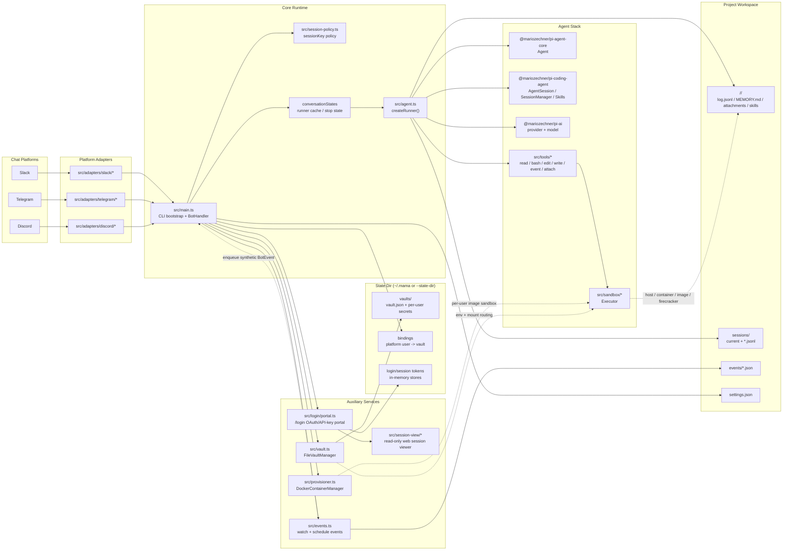
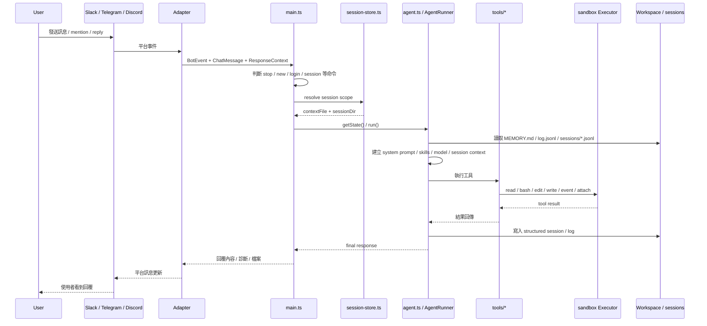
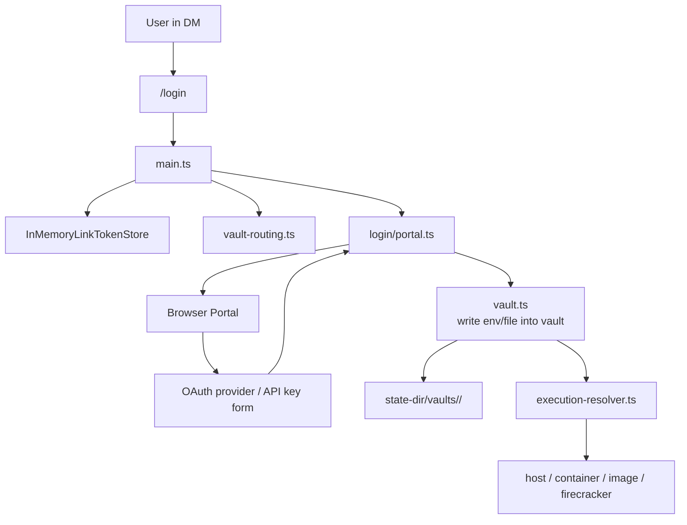

# mama Architecture

**mama** stands for **Multi-Agent Mischief Assistant**.

這份文件整理 `mama` 專案的核心架構，重點放在:

- 多平台訊息如何進入系統
- session / context 如何持久化
- agent 如何透過 tools 與 sandbox 執行工作
- login / vault / session viewer / events 如何掛接到主流程

## 1. 系統總覽



## 2. 主要分層

### A. 平台接入層

- `src/adapters/slack/*`
- `src/adapters/telegram/*`
- `src/adapters/discord/*`
- `src/adapter.ts`

職責:

- 接 Slack / Telegram / Discord 原生事件
- 轉成統一的 `BotEvent`、`ChatMessage`、`ChatResponseContext`
- 依平台規則計算 `sessionKey`
- 封裝回覆、typing、working、檔案上傳等平台差異

### B. 核心協調層

- `src/main.ts`
- `src/session-policy.ts`
- `src/store.ts`

職責:

- 啟動 CLI、讀取 env / args / `settings.json`
- 啟動各平台 bot
- 處理 `/login`、`/session`、`stop`、`new` 等控制命令
- 管理 `conversationStates`，避免同一 session 重複執行
- 決定每個 session 對應哪個 `AgentRunner`

### C. Agent 執行層

- `src/agent.ts`
- `src/context.ts`
- `src/tools/*`

職責:

- 建立 `AgentRunner`
- 載入模型、skills、memory、session context
- 將使用者訊息送入 `pi-agent-core` / `pi-coding-agent`
- 把 tool calls 接到本地 `read/bash/edit/write/event/attach`
- 把 tool 結果回寫 session，並透過 adapter 回傳給平台

### D. 執行環境層

- `src/sandbox/*`
- `src/provisioner.ts`
- `src/execution-resolver.ts`

職責:

- 統一抽象 `Executor`
- 支援 `host`、共享 `container`、per-user `image`、`firecracker`
- 依使用者 vault / binding 動態決定實際執行位置
- 在 `image` 模式下自動建立與回收 Docker container

### E. 狀態與持久化層

- `src/session-store.ts`
- `src/context.ts`
- `src/vault.ts`
- `src/bindings.ts`

職責:

- session 檔案管理: `sessions/current` 與 `*.jsonl`
- `log.jsonl` 與 structured session 的雙軌歷史保存
- workspace / conversation 級別 `MEMORY.md`
- per-user vault 憑證與 mount / env 注入
- 平台 user 與 vault 的綁定

### F. 輔助服務層

- `src/login/*`
- `src/session-view/*`
- `src/events.ts`

職責:

- 提供 Web login portal，支援 API key 與 OAuth 寫入 vault
- 提供 read-only session viewer
- 監看 `events/*.json`，把排程事件重新注入 bot 流程

## 3. 訊息處理流程



## 4. Session 與檔案佈局

`mama` 的上下文不是只靠記憶體，而是主要落在 workspace 目錄:

```text
<workspace>/
├── settings.json              # provider / model / sandbox limits
├── MEMORY.md                  # workspace 級記憶
├── events/                    # 排程與外部事件
└── <conversationId>/
    ├── MEMORY.md              # conversation 級記憶
    ├── log.jsonl              # 可 grep 的人類可讀訊息歷史
    ├── attachments/           # 平台附件下載
    ├── scratch/               # 執行中的工作區
    ├── skills/                # conversation 自訂 skills
    └── sessions/
        ├── current            # top-level session pointer
        ├── <timestamp>_<id>.jsonl
        └── <scope_id>.jsonl   # thread / reply scoped sessions
```

設計重點:

- `log.jsonl` 給人查詢與補 context
- `sessions/*.jsonl` 給 `SessionManager` 保留完整結構化上下文與 tool 結果
- top-level session 用 `current` 指標
- thread / reply session 用固定檔名，讓分支可被單獨追蹤

## 5. Login / Vault / Sandbox 關係



重點:

- 憑證不直接進 workspace
- vault 存在 `--state-dir`
- 執行時才由 vault 路由到對應 sandbox
- `image` / `firecracker` 模式下，憑證隔離比 host / shared container 更完整

## 6. Events 與一般對話的差異

`events/*.json` 會被 `EventsWatcher` 監看，之後轉成 synthetic `BotEvent` 再走一次正常流程。  
也就是說 events 不是獨立執行器，而是「另一個訊息入口」。

這讓下列能力共用同一套機制:

- session context
- vault routing
- tool execution
- 平台回覆
- stop / running state 管理

## 7. 架構結論

如果用一句話總結，`mama` 的核心其實是:

> 一個以 `main.ts` 為協調中心、以 `agent.ts` 為執行核心、以 `session/vault/sandbox` 為基礎設施的多平台 AI agent bot。

可以把它理解成 6 個核心子系統:

1. Platform adapters
2. Bot runtime orchestration
3. Agent + tools
4. Session/context persistence
5. Vault + sandbox execution routing
6. Web/event side services
